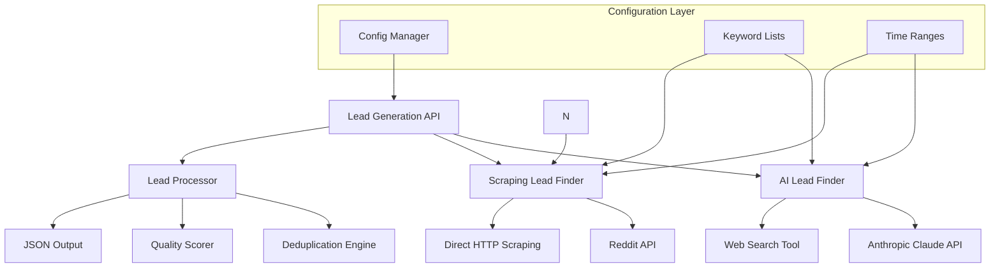

# Design Document

## Overview

The Reddit Lead Backend is a dual-approach system that combines AI-powered relevance detection with traditional keyword-based scraping to identify potential SaaS leads on Reddit. The system provides a unified interface for both methods while maintaining the flexibility to use each approach independently.

The design follows F5Bot's proven methodology for Reddit monitoring while adding AI enhancement for better lead quality assessment. The system will be built as a modular Python backend with clear separation between the AI and scraping components.

## Architecture



## Components and Interfaces

### 1. Lead Generation API (`lead_api.py`)
**Purpose:** Main entry point that orchestrates both AI and scraping approaches

**Key Methods:**
- `generate_leads(method='both', config=None)` - Main orchestration method
- `get_ai_leads(keywords, days, limit)` - AI-powered lead generation
- `get_scraped_leads(keywords, limit)` - Traditional scraping
- `merge_and_dedupe(ai_leads, scraped_leads)` - Combine results

**Configuration Interface:**
```python
class LeadConfig:
    keywords: List[str]

    days_back: int = 30
    limit: int = 100
    method: str = 'both'  # 'ai', 'scrape', 'both'
    min_hotness_score: int = 50
```

### 2. AI Lead Finder (`ai_lead_finder.py`)
**Purpose:** Enhanced version of your current reddit_ai.py with better error handling and configuration

**Key Features:**
- Configurable search parameters
- Improved prompt engineering for better relevance detection
- Structured response parsing
- Rate limiting and retry logic
- Quality scoring based on AI analysis

**Methods:**
- `search_reddit_ai(keywords, days, limit)` - Main AI search
- `parse_ai_response(response)` - Extract structured data from AI response
- `calculate_hotness_score(content)` - AI-based relevance scoring

### 3. Scraping Lead Finder (`scrape_lead_finder.py`)
**Purpose:** Enhanced version of your current reddit_scrape.py following F5Bot methodology

**Key Features:**

- Real-time monitoring capabilities
- Keyword matching with context analysis
- Rate limiting compliance
- Robust error handling

**Methods:**

- `filter_by_keywords(content, keywords)` - Keyword matching
- `extract_lead_data(reddit_item)` - Structure extraction
- `monitor_continuous(interval_minutes)` - Real-time monitoring

### 4. Lead Processor (`lead_processor.py`)
**Purpose:** Unified processing, deduplication, and quality assessment

**Key Features:**
- Cross-method deduplication
- Quality scoring normalization
- Output formatting
- Data validation

**Methods:**
- `deduplicate_leads(leads)` - Remove duplicates by permalink/content
- `normalize_scores(leads)` - Standardize quality scores across methods
- `format_output(leads)` - Consistent JSON structure
- `validate_lead_data(lead)` - Data integrity checks

## Data Models

### Lead Data Structure
```python
@dataclass
class Lead:
    id: str  # Generated unique identifier
    source_method: str  # 'ai' or 'scrape'
    author: str

    title: str
    content: str
    permalink: str
    created_utc: datetime
    content_type: str  # 'post' or 'comment'
    keywords_matched: List[str]
    hotness_score: int  # 1-100
    confidence_score: float  # AI confidence or keyword match strength
    raw_data: dict  # Original Reddit data for reference
```

### Configuration Models
```python
@dataclass
class AIConfig:
    anthropic_api_key: str
    model: str = "claude-3-7-sonnet-latest"
    max_tokens: int = 1500
    web_search_max_uses: int = 5

@dataclass
class ScrapingConfig:
    reddit_client_id: str
    reddit_client_secret: str
    reddit_user_agent: str
    rate_limit_delay: float = 1.0
    max_retries: int = 3
```

## Error Handling

### API Rate Limiting
- **Reddit API:** Implement exponential backoff with jitter
- **Anthropic API:** Respect rate limits with queue management
- **Web Search:** Handle search quota limits gracefully

### Error Recovery
- **Network Issues:** Retry with exponential backoff
- **Authentication Failures:** Clear error messages and credential validation
- **Malformed Data:** Skip invalid entries with logging
- **API Quota Exceeded:** Graceful degradation to available methods

### Logging Strategy
- Structured logging with different levels (DEBUG, INFO, WARNING, ERROR)
- Separate log files for AI and scraping operations
- Performance metrics logging (response times, success rates)
- Lead generation statistics tracking

## Testing Strategy

### Unit Tests
- **AI Lead Finder:** Mock Anthropic API responses, test prompt generation
- **Scraping Lead Finder:** Mock Reddit API responses, test keyword matching
- **Lead Processor:** Test deduplication logic, score normalization
- **Configuration:** Validate input parsing and error handling

### Integration Tests
- **End-to-End Workflows:** Test complete lead generation pipelines
- **API Integration:** Test actual Reddit and Anthropic API calls (with test credentials)
- **Data Flow:** Verify data consistency across components
- **Error Scenarios:** Test failure modes and recovery

### Performance Tests
- **Load Testing:** Test with large keyword lists and result sets
- **Rate Limiting:** Verify compliance with API limits
- **Memory Usage:** Monitor memory consumption with large datasets
- **Response Times:** Benchmark different configuration scenarios

### Test Data Strategy
- **Mock Reddit Data:** Create realistic test posts and comments
- **Keyword Test Sets:** Various SaaS-related keyword combinations
- **Edge Cases:** Empty results, malformed data, API errors
- **Regression Tests:** Ensure updates don't break existing functionality